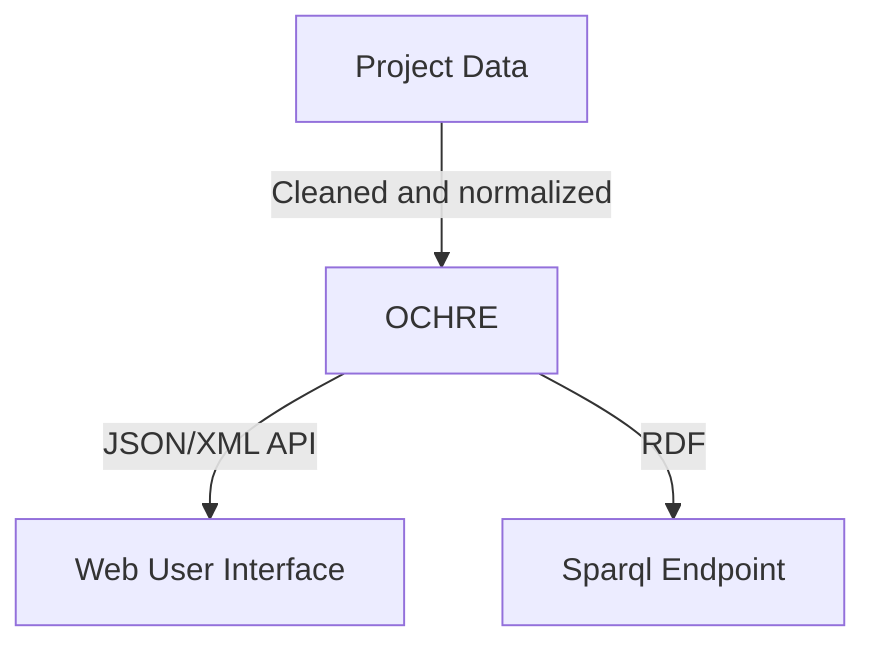

# Constraints for Linked Open Data

---

## UChicagoNode project

- Goal is to have a centralized website that allows for the sustainability of keeping digital collections up to date.
- Allow for reuse of features between collections
- Allow for discoverability

---

## How does Linked Open Data fit into UChicagoNode's architecture?

- Link out to existing authorities (like Library of Congress's Linked Data service and Getty's Topographical Name service)
- Linked Data is one of the targets service to be good participants in a shared web of humanities data. (Matching Europeana's data model in key points)

---

## OWL vs SHACL

1. OWL has an open world assumption. Just because we don't know the data doesn't mean we can't say it doesn't exist.
1. But how do we make sure the data we do have is the data as we want it to be?
1. "the axioms in an ontology are meant to _infer new knowledge_ rather than _trigger an inconsistency_" [Sirin 2010, 19].

---

## Why add constraints for RDF data?

1. Reliability of querying
1. Ensure data quality and reliability
1. Ensure export process and CI/CD pipeline for data and integrations

---

## Why SHACL?

1. Allows for triples to be defined in triples
1. Good tooling
1. Part of the import process
1. Allows for defining your data. It can force you to say what exactly your data should look like.
