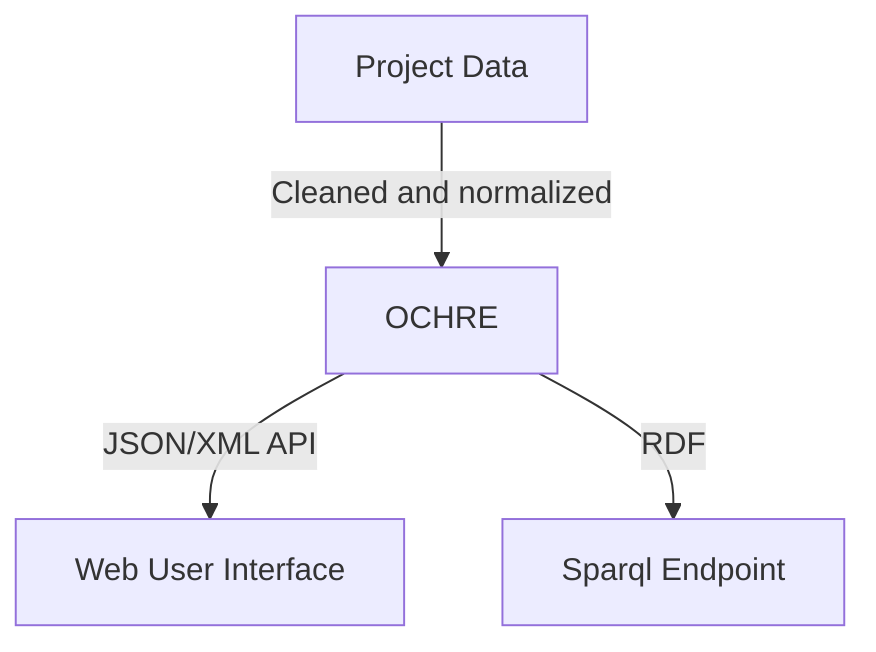

# Constraints for Linked Open Data

---

## UChicago Node Project

- Goal is to have a centralized website that allows for the sustainability of keeping digital collections up to date.

- Allow for reuse of features between collections

- Allow for discoverability

---

## How does Linked Open Data fit into UChicago Node's Architecture?

- Linked Data is incorporated into UChicago Node's own data to link out to existing authorities (like Library of Congress's Linked Data service and Getty's Topographical Name service)
- Linked Data is one of the targets for UChicago Node's service to be good participants in a shared web of humanities data. (Matching Europeana's data model in key points)



---

## OWL vs SHACL

1. "the axioms in an ontology are meant to _infer new knowledge_ rather than _trigger an inconsistency_" [Sirin 2010, 19].

1. OWL has an open world assumption. Just because we don't know the data doesn't mean we can't say it doesn't exist.

1. But how do we make sure the data we do have is the data as we want it to be?

---

## Why add constraints for RDF data?

1. Reliability of Querying

1. Ensure data quality and reliability

1. Ensure export process and CI/CD pipeline for data and integrations

---

## Why SHACL?

1. Allows for a triples to be defined in triples

1. Good tooling

1. Part of the import process

1. Allows for defining your data. It can force you to say what exactly your data should look like.

---

## Specific SHACL examples

---

## Using Regular Expressions to Validate Strings

- We are using ARK identifiers for each of our objects
- We want to make sure that these objects match the ark identifier minting pattern

```turtle
ucns:_ArkDctermsIdentifierProperty
  sh:datatype xsd:string ;
  sh:maxCount "1"^^xsd:integer ;
  sh:message "All resources with an ARK identifier need to have a match need to have an identifier." ;
  sh:minCount "1"^^xsd:integer ;
  sh:name "Identifier" ;
  sh:path dcterms:identifier ;
  sh:pattern "^https:\\/\\/n2t\\.net\\/ark:61001\\/[0-9a-zA-Z]{12}(\\/file(\\.(wav|tif)))?$" ;
  .

```

---

## Matching Different Possible Classes for Objects

```turtle
ucns:_DctermsSpatialProperty
  sh:message "The spatial property should have TGN identifier." ;
  sh:minCount "1"^^xsd:integer ;
  sh:name "Spatial" ;
  sh:path dcterms:spatial ;
  sh:or (
    [ sh:class gvo:PhysAdminPlaceConcept ]
    [ sh:class gvo:PhysPlaceConcept ]
    [ sh:class gvo:AdminPlaceConcept ]
    [ sh:hasValue "(:unav)" ]
    [ sh:hasValue "(:unkn)" ]
  )
  .
```

---

## Matching Agreement of One among Many

- Embedding SPARQL queries inside SHACL for more robust validation
- This SPARQL query insures that the `dcterms:type` matches one of the `dc:type`.
- There can be multiple types, but each one needs to have a match among the other property.

```turtle
  sh:sparql [
    a sh:SPARQLConstraint ;
    sh:message "Values of dcterms:Types match  the dc:type" ;
    sh:prefixes <http://lib.uchicago.edu/shapes/> ;
    sh:select """
      SELECT $this (dc:type AS ?path) ?dcValue
      WHERE {
          $this
            $PATH ?termsValue ;
        .
        FILTER NOT EXISTS {
          ?this dc:type ?termsValue .
        }
      }
    """ ;
  ] ;
```

---

## Constraining Classes for non-OWL Ontologies

- Uses the `sh:node` to show that it belongs to the `dcterms:DCMIType`
- Notice we are using two different validations.
- As long as the

```turtle
ucns:_DcTypeProperty
  sh:node [
    rdf:type sh:NodeShape ;
    sh:property [
      sh:path dcam:memberOf ;
      sh:hasValue dcterms:DCMIType ;
    ] ;
  ] ;
  sh:message "All term types should belong to the DCM class" ;
  sh:minCount "1"^^xsd:integer ;
  sh:name "Type" ;
  sh:path dc:type ;
  .

```

---

## Principles for Better SHACL

---

## Define your data

- Try to avoid using `xsd:anyURI` and bare `xsd:string` as data types.
- Ask the question: what do you want this data to be?
- The more precise your definitions the better control you can have over the data

---

## Use Named Nodes and Not Blank Nodes

- Using Named Nodes provides better context for Error Messages

- This makes it easier to locate and understand why the message was generated

- All of the SHACL documentation uses blank nodes, but it is better to not use them for your Node Shapes and Property Shapes

---

## Use `sh:messages`

- `sh:message` is like a comment, it is returned in a failed validation report, use these as comments that will show why the message failed.

---

## Closed Shapes

- A Closed shape means that only the properties defined in the shape can be used on an instance of that shape.

- A closed shape breaks the Open World Assumption

- Closed Shapes allow for greater control over your constraints

- Closed shapes mean no additional data can be included

---

## Bibliography

Irene Polikoff ["Why I Use SHACL For Defining Ontology Models"](https://archive.topquadrant.com/shacl-blog/)

Irene Polikoff ["Why I don't use OWL Anymore"](https://archive.topquadrant.com/owl-blog/)

Bob DuCharme ["You probably don't need OWL: And if you do there's a simple way to prove it"](https://www.bobdc.com/blog/dontneedowl/)

Sirin, Evan ["Data Validation with OWL Integrity Constraints"](https://doi.org/10.1007/978-3-642-15918-3_2)
